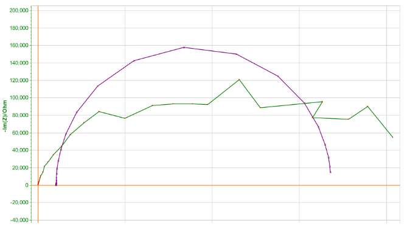
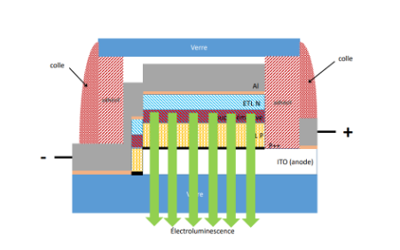
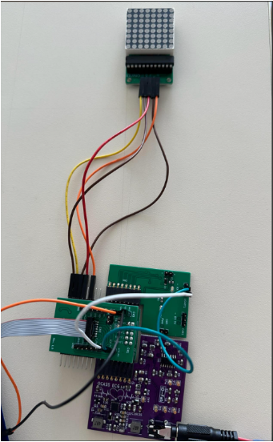
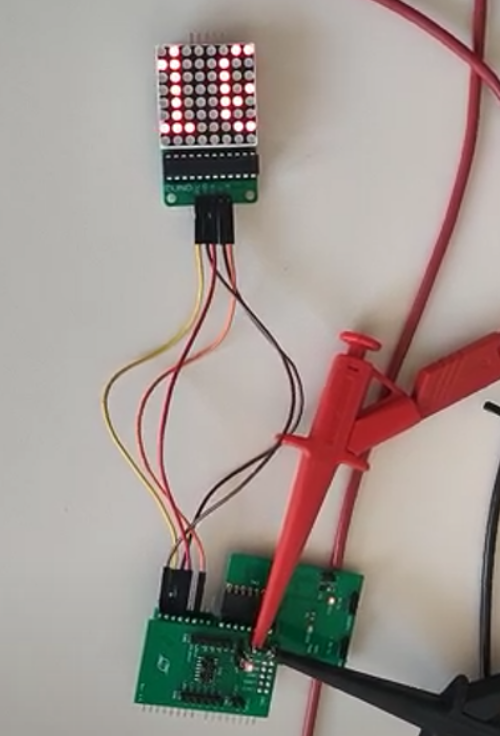

# ECG Monitoring System with Custom OLED screen and Biosensors

**Real-time cardiac monitoring system featuring cleanroom-fabricated flexible electrodes, analog signal conditioning, and embedded DSP on STM32 microcontroller.**


## Project Highlights

- **Cleanroom Microfabrication**: Gold/PEDOT electrodes on flexible Kapton substrate (50μm) and OLED matrix via thermal evaporation under inert atmosphere
- **Low-Level Embedded**: STM32L432 with custom ADC pipeline (1500 Hz, 12-bit)
- **Real-Time DSP**: FIR bandpass + Kalman filtering, Pan-Tompkins peak detection
- **Full Stack**: Analog conditioning → firmware → SPI display driver

**Technologies**: C, STM32CubeIDE (UART/SPI/ADC), FreeRTOS concepts, Photolithography, Signal Processing

---

## System Architecture


## Hardware: Custom Electrode and OLED screen Fabrication

### Electrode fabrication process (3 days)
1. **Photolithography** on Kapton substrate
2. **Metal evaporation**: 5nm Cr + 100nm Au
3. **PEDOT coating** for biocompatibility
4. **Impedance characterization**: Potentiostat testing

**Key Result**: Lower impedance than commercial electrodes in 10-100Hz range (cardiac signal band)



*Green: Custom electrodes | Purple: Commercial reference*

### OLED screen fabrication process (organic stack deposited via thermal evaporation under inert atmosphere over 3 days)
1. **p++ layer** (10×10mm active area) - hole injection enhancement
2. **HTL (TCTA)**: 120nm hole transport layer
3. **EML co-evaporation**: TPBi host + Ir(acac) phosphorescent dopant (~5%)
4. **ETL (TPBi)**: 70nm electron transport layer  
5. **HBL (LiF)**: 1nm hole blocking layer
6. **Aluminum cathode**: 150nm, evaporated at 1Å/s
7. **UV-cured glass encapsulation**

**Electrical Characterization**:
- Two conduction regimes identified:
  - Low voltage: Ohmic behavior (J ∝ V)
  - High voltage: Space-charge limited current (J ∝ V²/d³)
- Turn-on voltage: ~9V
- Carrier mobility: μ_avg = 7.2×10⁻⁹ m²/Vs

**Critical Failure**: UV curing generated ozone (O₃) which oxidized the aluminum cathode, creating an insulating Al₂O₃ layer. Matrix functioned during initial test but failed after encapsulation.



*Top: Schema of the finished OLED matrix | Bottom: Initial pixel test at 9V*

### Signal Conditioning Circuit
- Differential instrumentation amplifier (high CMRR)
- Analog filters: 0.16Hz HPF, 150Hz LPF, 50Hz notch
- ±15V symmetric power supply
- PCB assembly with reflow soldering

## Firmware Architecture

### Core Modules

**1. Acquisition (`adc_acquisition.c`)**
```c
// 12-bit ADC @ 1500Hz into circular buffer
// Resolution: 0.8mV theoretical
#define SAMPLING_FREQUENCY 1500
#define BUFFER_SIZE 7500  // 5-second window
```

**2. Digital Filtering (`signal_processing.c`)**
- **FIR filter** (order 15): Preserves QRS morphology (10-25Hz)
- **Kalman filter**: Adaptive noise reduction
  - Process noise: Q = 0.125
  - Measurement noise: R = 32.0

**3. Peak Detection (`peak_detection.c`)**
```c
// Adaptive thresholding + 200ms refractory period
// Heart rate: Average of last 10 RR intervals
if (filteredValue > PEAK_THRESHOLD && 
    (bufferIndex - lastPeakIndex) > MIN_RR_SAMPLES) {
    // New R-peak detected
    heartRate = 60.0f * SAMPLING_FREQUENCY / avgRR;
}
```

**4. Display Driver (`max7219_driver.c`)**
- SPI communication (16-bit frames)
- 800Hz multiplexing handled by MAX7219

## Results & Analysis



*Complete assembly with ECG card and OLED matrix*


*Raw signal recorded and observed on the oscilloscope*



*Example of BPM display on our OLED matrix*

### What Worked
 - Electrode fabrication process validated  
 - Analog circuit functional (signal visible on oscilloscope)  
 - ADC acquisition pipeline operational  
 - Digital filter algorithms implemented  

### Technical Challenges
 - **Signal quality**: Negative voltage phases caused ADC saturation (many zero values)  
 - **Core layer issue**: Required STM32 board replacement for stable acquisition  
 - **Display interface**: MAX7219 connection not validated in time  
 - **OLED matrix**: Aluminum passivation during UV curing (O₃ formation)

### Performance Metrics
- **Electrode impedance**: Lower than commercial in cardiac band
- **Electrode mobility**: μ_avg = 7.2×10⁻⁹ m²/Vs (limited by short-circuit)
- **ADC resolution**: 0.8mV theoretical (12-bit @ 3.3V range)

## Technical Documentation

- [Full Technical Report](docs/full-report.pdf) (19 pages, in French)
- [Electrodes fabrication process](hardware/electrodes/fabrication-process-electrode.md)
- [OLED fabrication process](hardware/oled-matrix/fabrication-process-oled.md)
- [Lessons Learned](docs/lessons-learned.md)

## Skills Demonstrated

**Embedded Systems**
- Bare-metal STM32 programming (HAL library)
- Real-time ADC acquisition with DMA
- SPI/UART peripheral configuration
- Circular buffer management

**Signal Processing**
- FIR filter design and implementation
- Kalman filtering for biological signals
- Peak detection algorithms
- Fixed-point arithmetic considerations

**Hardware**
- Cleanroom microfabrication (photolithography, evaporation)
- Analog circuit design for biosignals
- PCB assembly and debugging
- Electrochemical characterization


*This project demonstrates end-to-end system development from atoms to algorithms: microfabrication → analog electronics → embedded firmware → signal processing.*
