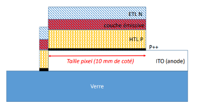

# OLED Matrix Fabrication Log

8×8 passive matrix OLED - Complete process diary with measurements and observations.

---

## Session 1: Substrate Preparation & p++ Layer

**Date**: [Your date]  
**Duration**: 3 hours  
**Cleanroom**: Yellow room (photolithography area)

### Initial Measurements

**ITO Thickness Verification** (Profilometer - 10 points)
- Average: 56nm
- Specification: 60nm ± 10%
- ✅ Within tolerance

### p++ Hole Injection Layer

**Process Parameters**:
- Mask: 10×10mm shadow mask
- Evaporation method: Thermal (glove box)
- Target thickness: [specify]
- Pressure: <10⁻⁶ mbar


**Observations**:
- Uniform deposition across active area
- Clean edge definition from shadow mask
- Color change visible on ITO surface

---

## Session 2: Organic Stack Deposition

**Date**: [Your date]  
**Duration**: 4 hours  
**Environment**: N₂ glove box (<0.1 ppm O₂, H₂O)

### HTL: Hole Transport Layer (TCTA)

| Parameter | Value |
|-----------|-------|
| Material | TCTA |
| Target thickness | 120nm |
| Deposition rate | ~0.5Å/s |
| Tooling factor | [specify] |
| Final thickness | [measured]nm |


**Notes**: Stable evaporation rate achieved after 2min warm-up

---

### EML: Emissive Layer (Co-evaporation)

| Parameter | Host (TPBi) | Dopant (Ir(acac)) |
|-----------|-------------|-------------------|
| Target thickness | 10nm | - |
| Doping ratio | - | ~5% |
| Rate (host) | 0.8Å/s | - |
| Rate (dopant) | 0.04Å/s | - |


**Critical**: Simultaneous evaporation requires precise rate control  
**Challenge**: Dopant rate fluctuated ±0.01Å/s (acceptable range)

---

### ETL: Electron Transport Layer (TPBi)

| Parameter | Value |
|-----------|-------|
| Material | TPBi |
| Target thickness | 70nm |
| Deposition rate | ~1.0Å/s |
| Substrate temperature | Room temp |



---

### HBL: Hole Blocking Layer (LiF)

**Mask Change**: Switched to partial coverage mask

| Parameter | Value |
|-----------|-------|
| Material | LiF |
| Target thickness | 1nm |
| Deposition rate | 0.2Å/s |
| Notes | Ultra-thin layer, critical for efficiency |


---

## Session 3: Cathode & Encapsulation

**Date**: [Your date]  
**Duration**: 2.5 hours

### Aluminum Cathode Deposition

| Parameter | Value |
|-----------|-------|
| Material | Aluminum |
| Target thickness | 150nm |
| Power | 26% |
| Target rate | 1.0Å/s |
| Actual rate | 0.8-1.2Å/s |

**Deposition Profile**:


*Rate and thickness vs. time - stable region highlighted*

**Observations**:
- Rate stabilization took ~5 minutes
- Thickness accumulation only after reaching 1Å/s
- Total deposition time: ~15 minutes

---

### Initial Functional Test

**Before encapsulation**:
- Applied voltage: 9V
- Result: Pixels illuminate!
- Observation: Cross-talk visible (same row/column dims)


*First successful pixel illumination at 9V*

**Voltage-Current Sweep**:
- Turn-on voltage: ~6-7V
- Brightness increases rapidly above 9V
- No signs of short circuit at this stage

---

### Encapsulation (UV-Curable Epoxy)

**Process**:
1. Applied glass cap with UV epoxy bead
2. UV exposure: 365nm, 90 seconds
3. Visual inspection: Good seal


**CRITICAL FAILURE POINT**

---

## Post-Encapsulation Analysis

### Problem Discovery

**Next session test**: Matrix completely non-functional
- No current flow at any voltage
- No light emission
- Infinite resistance measured

### Root Cause Analysis

**Aluminum Passivation Mechanism**:
```
UV (365nm) + O₂ → O₃ (ozone)
2Al + 3O₃ → Al₂O₃ (aluminum oxide)
```


*Schematic: Ozone formation during UV curing oxidizes cathode*

**Evidence**:
- Photodector measurements show residual luminescence (EML still functional)
- Electrical measurements show open circuit (cathode insulated)
- Literature confirms Al oxidation under UV + O₂

### Electrical Characterization (Before Failure)

**J-V Characteristics**:


*Two conduction regimes visible: Ohmic (slope=1) → SCLC (slope=2)*

**Calculated Mobility**:
- μ_avg = 7.2×10⁻⁹ m²/Vs
- Lower than expected (short circuit detected)
- Space-charge limited current regime confirmed

---

## Lessons Learned

### What Worked 
- All organic layer depositions successful
- Initial device functionality confirmed
- Clean room protocols maintained throughout

### Critical Failures 
- **Encapsulation protocol flawed**: UV curing must occur in inert atmosphere
- **Short circuit present**: Reduced overall device performance
- **No intermediate testing**: Should have characterized before each layer

### Improvements for Next Run

1. **Encapsulation**: Use O₂-free UV chamber OR oxygen getter materials
2. **Quality control**: Test electrical properties after each major layer
3. **Short circuit prevention**: Better mask alignment and edge bead removal
4. **Documentation**: Real-time logging of deposition rates for reproducibility

---

## Equipment & Parameters Summary

| Equipment | Model | Key Settings |
|-----------|-------|--------------|
| Thermal Evaporator | [model] | <10⁻⁶ mbar |
| Glove Box | [model] | <0.1 ppm O₂/H₂O |
| Profilometer | [model] | Step height mode |
| QCM | [model] | Tooling factor calibrated |
| UV Lamp | 365nm | 90s exposure |

---

## Final Device Metrics

| Parameter | Target | Achieved | Notes |
|-----------|--------|----------|-------|
| Active area | 8×8 pixels | ✅ | 64 pixels total |
| Turn-on voltage | <10V | 9V ✅ | Before failure |
| Layer uniformity | ±5% | ✅ | QCM verified |
| Encapsulation | Functional | ❌ | Passivation issue |
| Overall yield | 100% | 0% | Post-encapsulation |

---

**Total Time**: 3 sessions × 3 hours = 9 hours  
**Material Cost**: ~€50-100 (organic materials expensive)  
**Knowledge Gained**: Priceless (especially failure modes!)